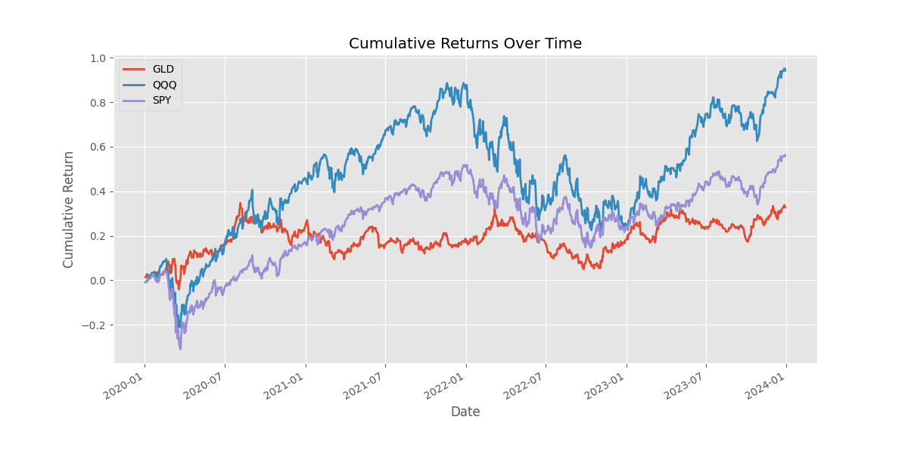
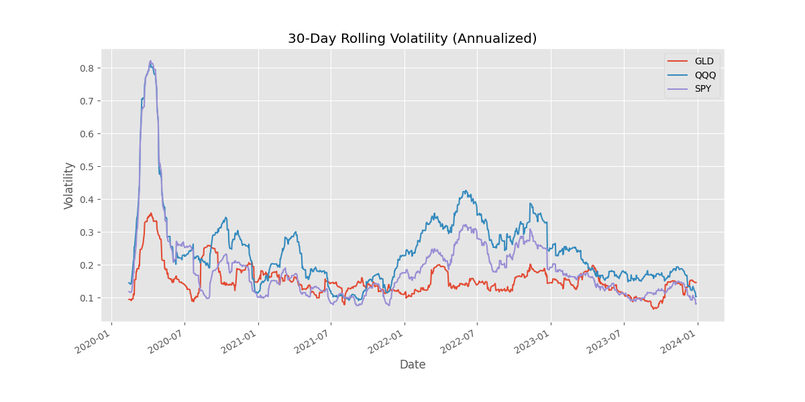
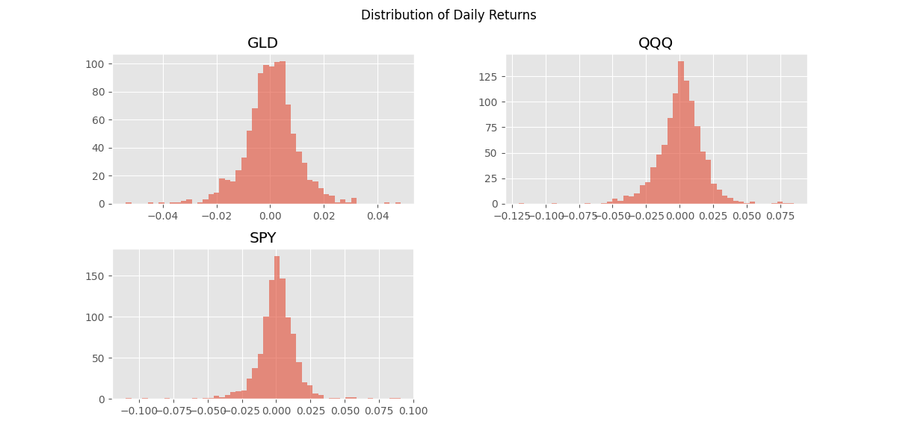

# Financial Analyzer 📈

A Python tool to fetch stock data (Yahoo Finance), calculate returns/volatility, and visualize performance.

## 🚀 Quick Start

1. **Install dependencies:**
   ```bash
   pip install -r requirements.txt
   ```

2. **Run analysis:**
   ```bash
   python main.py
   ```

3. **View results:**
   Check the `output/` folder for volatility and return plots.

## 📊 Features
- Arithmetic & Log Returns
- Sharpe & Sortino Ratios
- Rolling Volatility
- Matplotlib visualizations

## 🖼️ Example Output




